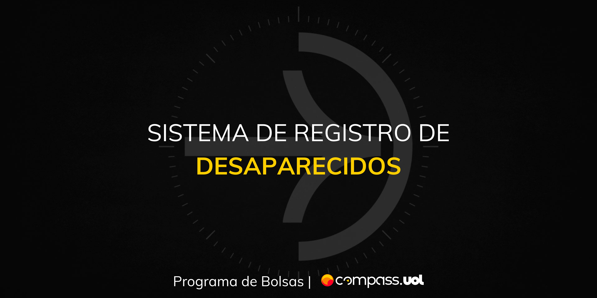
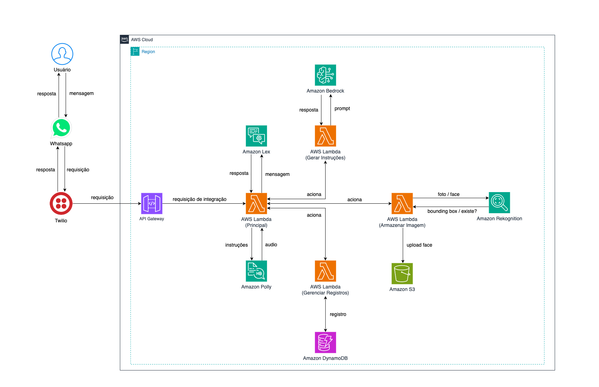

## **DESCRIÇÃO DO PROJETO**

Esse sistema consiste em uma ferramenta a ser utilizada para o registro, localização e acompanhamento de pessoas desaparecidas. A partir de um chatbot os usuários que desejem notificar o desaparecimento de uma pessoa deverão submeter uma foto do desaparecido e algumas informações adicionais de contato enquanto que os usuários que desejem notificar a localização de pessoas desaparecidas deverão da mesma forma submeter uma foto da pessoa encontrada juntamente com algumas outras informações. A cada registro de desaparecimento ou de localização o sistema realizará uma varredura no banco de pessoas desaparecidas com o intuito de notificar os responsáveis pelo desaparecido quando este for identificado utilizando o Amazon Rekognition. Além disso, a ferramenta será capaz de fornecer instruções de como agir em caso de desaparecimento ou localização de uma pessoa a partir do Amazon Bedrock, instruções essas que serão transmitidas ao usuário através de um áudio gerado a partir do Amazon Polly.

[](https://skillicons.dev)

## **FUNCIONAMENTO DO SISTEMA**

[](https://www.whatsapp.com/?lang=pt_BR) Através do canal de comunicação usuário possui as seguintes funcionalidades disponíveis:

- ### REGISTRAR DESAPARECIMENTO

  A funcionalidade de Registrar Desaparecimento é responsável por coletar e registrar informações sobre uma pessoa desaparecida e o usuário que está reportando o desaparecimento. O processo é iniciado quando o usuário expressa a intenção de registrar um desaparecimento através de frases como "Quero registrar um desaparecimento" ou "Uma pessoa desapareceu".

  O chatbot responde solicitando algumas informações essenciais para a busca, incluindo o nome do usuário, seu email de contato, o nome completo do desaparecido, a data de nascimento, o sexo e uma descrição do desaparecido. O usuário também deve fornecer uma foto da pessoa desaparecida. Após o recebimento dessas informações, o sistema realiza as seguintes ações:

  - **Validação da Foto**: A foto enviada é verificada para garantir que atende aos requisitos necessários como formato PNG ou JPG e se existe somente uma pessoa na imagem. Se a foto não for válida, o usuário será solicitado a enviar uma nova imagem.

  - **Armazenamento dos Dados**: As informações fornecidas são armazenadas no banco de dados, e a foto é indexada utilizando o Amazon Rekognition.

  - **Geração de Instruções**: Instruções sobre como proceder após o registro do desaparecimento são geradas pelo Amazon Bedrock e convertidas em áudio pelo Amazon Polly, sendo então enviadas ao usuário.

  - **Confirmação do Registro**: O sistema confirma o registro e informa ao usuário que o desaparecimento foi registrado com sucesso e retorna um número de protocolo que pode ser usado posteriormente para acompanhar o status. Caso a foto enviada corresponda a uma pessoa já registrada como desaparecida, o sistema notifica o usuário sobre essa correspondência ja ter sido cadastrada na base de dados.

- ### REGISTRAR LOCALIZAÇÃO DE UMA PESSOA ENCONTRADA

  A funcionalidade de Registrar Pessoa Localizada é destinada a notificar o sistema quando alguém encontra uma pessoa perdida. O processo é iniciado quando o usuário expressa a intenção de registrar uma pessoa localizada através de frases como "Encontrei uma pessoa perdida" ou "Alguém perdido está comigo".

  O chatbot responde solicitando algumas informações essenciais para verificar se a pessoa encontrada já está registrada como desaparecida no sistema, incluindo o nome do usuário, seu email de contato, nome completo da pessoa localizada, idade aparente, sexo, breve descrição da pessoa e uma foto da pessoa localizada. A foto validada é utilizada pelo Rekognition para verificar a semelhança entre as faces armazenadas no banco de pessoas desaparecidas e da foto enviada, para assim reconhecer se existe uma solicitação em aberto de uma caso de desaparecimento respectivo para esta pessoa.

  Após a foto ter sido validada utilizando a mesma estratégia descrita na funcionalidade anterior, o sistema aplica a mesma lógica de armazenamento de dados, geração de instruções, confirmação de registro e fornecimento de um protocolo porém ajustado para se adequar a este contexto.

- ### ACOMPANHAR STATUS DE ALGUM REGISTRO

  Após o recebimento do número de protocolo fornecido pelo usuário, o sistema realiza a validação do protocolo e aplica a lógica de verificação do status do registro. O sistema verifica se o número de protocolo fornecido é válido, caso o protocolo seja inválido, uma mensagem de erro é enviada ao usuário, solicitando a reinserção do número de protocolo. Se ocorrer um erro ao processar a solicitação, uma mensagem de erro correspondente é enviada ao usuário.

  No caso em que o protocolo for válido, o sistema verifica o status atual do registro associado. Se a pessoa foi encontrada, o usuário é notificado com uma mensagem de sucesso e instruções sobre como proceder. O sistema também indica que o status foi atualizado e que o usuário deve verificar suas comunicações cadastradas para mais informações. Se a pessoa ainda está desaparecida, o usuário é informado que o status permanece o mesmo e que o sistema entrará em contato assim que houver uma atualização.

## **ARQUITETURA**



## **TECNOLOGIAS E FERRAMENTAS**

[](https://www.serverless.com)
[](https://aws.amazon.com/pt/cli/)
[](https://aws.amazon.com/pt/s3/)
[](https://aws.amazon.com/pt/pm/dynamodb/)
[](https://aws.amazon.com/pt/bedrock/)
[](https://aws.amazon.com/pt/rekognition/)
[](https://aws.amazon.com/pt/transcribe/)
[](https://aws.amazon.com/pt/transcribe/)

## **GUIA DE INSTALAÇÃO**

- Clone o repositório e navegue até a branch mencionada.

```ruby
$ git clone https://github.com/GiovaneIwamoto/reconnect-people.git
$ cd reconnect-people
$ git checkout main
```

> [!NOTE]
> Para garantir o funcionamento correto de seu ambiente é crucial configurar adequadamente as variáveis de ambiente. Isso inclui definir os valores apropriados para os parâmetros mencionados no arquivo _env-sample.yml_

- Configure o framework Serverless e as credenciais AWS.

```ruby
$ serverless
```

```ruby
$ aws configure
AWS Access Key ID [None]: EXAMPLEKEYID
AWS Secret Access Key [None]: SECRETACCESSKEYEXAMPLE
Default region name [None]: us-east-1
Default output format [None]: ENTER
```

> [!IMPORTANT]
> Para utilizar o serviço Amazon Bedrock é essencial habilitar o modelo _amazon.titan-text-premier-v1:0_. Este modelo oferece recursos avançados de processamento de linguagem natural, permitindo que a aplicação realize a geração de texto.

- Navegue até a pasta onde se encontra o arquivo Serverless e realize o deploy da aplicação.

```ruby
$ cd backend
$ serverless deploy
```

> [!CAUTION]
> Na sua conta da Twilio configure o método GET adequadamente com o endpoint fornecido pelo Serverless após realizar o deploy na aba de configurações de WhatsApp Sandbox como na tabela abaixo:

| URL Endpoint When a message comes in                        | Method |
| ----------------------------------------------------------- | ------ |
| https://example.execute-api.us-east-1.amazonaws.com/chatbot | GET    |

---


[Adelson Nunes](https://github.com/imrooteodoro) | [Giovane Iwamoto](https://github.com/GiovaneIwamoto) | [Leandro Pereira](https://github.com/leojgpereira) | [Letícia Leme](https://github.com/leticiaaleme) | [Renan Mazzilli](https://github.com/renan-mazzilli)
